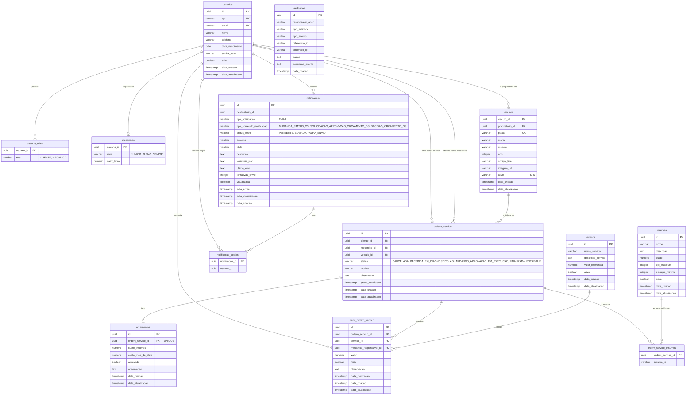

# Modelo entidade-relacionamento

Modelo relacional do PostgreSQL do ServiceTrack.

**Fonte de verdade:** as migrations Flyway em
`service-track-api/software/service-track-api/_infrastructure/src/main/resources/db/migration/`.
O schema pertence à aplicação (`DB-ADR-002`); este documento descreve o resultado, não o
define. Ao alterar uma migration, atualizar este documento no mesmo ciclo.

Estado descrito: `V1__baseline_schema.sql` + `V3__update_notificacao_tipo_conteudo_constraint.sql`.

---

## Diagrama

---

## Agregados e cardinalidades

| Relação | Cardinalidade | Como é imposta |
|---|---|---|
| `usuarios` → `usuario_roles` | 1:N | FK `fk_usuario_roles_usuario` |
| `usuarios` → `mecanicos` | 1:0..1 | PK compartilhada, **sem FK** |
| `usuarios` → `veiculos` | 1:N | FK `fk_veiculo_proprietario` |
| `usuarios` → `ordens_servico` (cliente) | 1:N | FK `fk_ordem_cliente` |
| `usuarios` → `ordens_servico` (mecânico) | 1:N | FK `fk_ordem_mecanico` |
| `veiculos` → `ordens_servico` | 1:N | FK `fk_ordem_veiculo` |
| `ordens_servico` → `orcamentos` | 1:0..1 | FK + `UNIQUE` em `ordem_servico_id` |
| `ordens_servico` → `itens_ordem_servico` | 1:N | FK `fk_item_ordem_servico` |
| `servicos` → `itens_ordem_servico` | 1:N | FK `fk_item_servico` |
| `usuarios` → `itens_ordem_servico` | 1:N, opcional | FK `fk_item_mecanico_responsavel` |
| `ordens_servico` → `ordem_servico_insumos` | 1:N | FK `fk_ordem_servico_insumos_ordem` |
| `insumos` → `ordem_servico_insumos` | 1:N | **sem FK** — tipos divergentes |
| `notificacoes` → `notificacao_copias` | 1:N | FK `fk_notificacao_copias_notificacao` |

A raiz transacional é `ordens_servico`: orçamento, itens e insumos só existem em função dela.
`usuarios` é a única entidade referenciada por quase todo o modelo — cliente, mecânico
responsável e destinatário de notificação são o mesmo registro em papéis diferentes,
distinguidos por `usuario_roles`.

---

## Chaves e restrições

**Unicidade de negócio:** `usuarios.cpf`, `usuarios.email`, `veiculos.placa` e
`orcamentos.ordem_servico_id`. O `cpf` único é o que sustenta a autenticação por CPF.

**Domínios fechados por `CHECK`:** `usuario_roles.role`, `mecanicos.nivel`,
`ordens_servico.status`, `veiculos.ativo`, e os três de `notificacoes`. São enums da aplicação
espelhados no banco — mudar o enum sem migration nova quebra a inserção em runtime.

**Índices explícitos:** apenas `idx_auditoria_referencia_id` e `idx_auditoria_data_criacao`.
As demais consultas dependem dos índices implícitos de PK e `UNIQUE`.

---

## Divergências conhecidas

Levantadas na leitura do schema. Nenhuma está corrigida — correção é migration nova, e
migrations são append-only.

| # | Divergência | Consequência |
|---|---|---|
| M-01 | `ordem_servico_insumos.insumo_id` é `varchar(255)`, mas `insumos.id` é `uuid` | Impede a FK. Insumo inexistente pode ser gravado numa OS sem o banco recusar |
| M-02 | `mecanicos.usuario_id` é PK sem FK para `usuarios` | Mecânico órfão é possível; remover o usuário não é barrado |
| M-03 | `notificacoes.destinatario_id` sem FK | Notificação para destinatário inexistente é aceita |
| M-04 | `notificacao_copias.usuario_id` sem FK | Cópia para usuário inexistente é aceita |
| M-05 | `auditorias.responsavel_acao` é `varchar(36)` sem FK | Deliberado: auditoria precisa sobreviver à remoção do usuário. Documentado aqui para não ser lido como esquecimento |
| M-06 | `veiculos.ativo` é `varchar` com `CHECK ('S','N')`, enquanto `usuarios.ativo` e `insumos.ativo` são `boolean` | Inconsistência de representação do mesmo conceito |
| M-07 | PK de `veiculos` chama-se `veiculo_id`; nas demais tabelas chama-se `id` | Quebra a convenção de nomenclatura |
| M-08 | Nenhuma FK tem índice explícito | `JOIN` e verificação de integridade varrem a tabela filha. Sensível em `itens_ordem_servico` e `ordens_servico` |
| M-09 | Sem `ON DELETE` declarado em nenhuma FK | Comportamento padrão é `NO ACTION`; remoção de OS com itens falha sem mensagem de domínio |

M-01 a M-04 são de integridade referencial e valem uma migration corretiva antes de tratar
o modelo como estável. M-08 tende a aparecer primeiro como latência, não como erro.

---

## Volumetria e orçamento de conexões

O dimensionamento da instância e o teto de conexões de cada consumidor estão em
[`DB-ADR-004`](../adr/DB-ADR-004-orcamento-de-conexoes.md), não aqui. O modelo não impõe
carga relevante de escrita: o caminho quente é leitura de `ordens_servico` com `JOIN` em
`usuarios` e `veiculos`, que é exatamente onde M-08 pesa.
