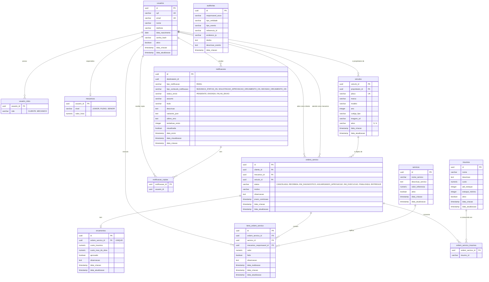

# Modelo entidade-relacionamento

```mermaid
erDiagram
    usuarios ||--o{ usuario_roles : "possui"
    usuarios ||--o| mecanicos : "especializa"
    usuarios ||--o{ veiculos : "e proprietario de"
    usuarios ||--o{ ordens_servico : "abre como cliente"
    usuarios ||--o{ ordens_servico : "atende como mecanico"
    usuarios ||--o{ itens_ordem_servico : "executa"
    usuarios ||--o{ notificacoes : "recebe"
    usuarios ||--o{ notificacao_copias : "recebe copia"

    veiculos ||--o{ ordens_servico : "e objeto de"

    ordens_servico ||--o| orcamentos : "tem"
    ordens_servico ||--o{ itens_ordem_servico : "contem"
    ordens_servico ||--o{ ordem_servico_insumos : "consome"

    servicos ||--o{ itens_ordem_servico : "tipifica"
    insumos ||--o{ ordem_servico_insumos : "e consumido em"

    notificacoes ||--o{ notificacao_copias : "tem"

    usuarios {
        uuid id PK
        varchar cpf UK
        varchar email UK
        varchar nome
        varchar telefone
        date data_nascimento
        varchar senha_hash
        boolean ativo
        timestamp data_criacao
        timestamp data_atualizacao
    }

    usuario_roles {
        uuid usuario_id FK
        varchar role "CLIENTE, MECANICO"
    }

    mecanicos {
        uuid usuario_id PK
        varchar nivel "JUNIOR, PLENO, SENIOR"
        numeric valor_hora
    }

    veiculos {
        uuid veiculo_id PK
        uuid proprietario_id FK
        varchar placa UK
        varchar marca
        varchar modelo
        integer ano
        varchar codigo_fipe
        varchar imagem_url
        varchar ativo "S, N"
        timestamp data_criacao
        timestamp data_atualizacao
    }

    ordens_servico {
        uuid id PK
        uuid cliente_id FK
        uuid mecanico_id FK
        uuid veiculo_id FK
        varchar status "CANCELADA, RECEBIDA, EM_DIAGNOSTICO, AGUARDANDO_APROVACAO, EM_EXECUCAO, FINALIZADA, ENTREGUE"
        varchar motivo
        text observacao
        timestamp prazo_conclusao
        timestamp data_criacao
        timestamp data_atualizacao
    }

    orcamentos {
        uuid id PK
        uuid ordem_servico_id FK "UNIQUE"
        numeric custo_insumos
        numeric custo_mao_de_obra
        boolean aprovado
        text observacao
        timestamp data_criacao
        timestamp data_atualizacao
    }

    itens_ordem_servico {
        uuid id PK
        uuid ordem_servico_id FK
        uuid servico_id FK
        uuid mecanico_responsavel_id FK
        numeric valor
        boolean feito
        text observacao
        timestamp data_realizacao
        timestamp data_criacao
        timestamp data_atualizacao
    }

    servicos {
        uuid id PK
        varchar nome_servico
        text descricao_servico
        numeric valor_referencia
        boolean ativo
        timestamp data_criacao
        timestamp data_atualizacao
    }

    insumos {
        uuid id PK
        varchar nome
        text descricao
        numeric custo
        integer qtd_estoque
        integer estoque_minimo
        boolean ativo
        timestamp data_criacao
        timestamp data_atualizacao
    }

    ordem_servico_insumos {
        uuid ordem_servico_id FK
        varchar insumo_id
    }

    notificacoes {
        uuid id PK
        uuid destinatario_id
        varchar tipo_notificacao "EMAIL"
        varchar tipo_conteudo_notificacao "MUDANCA_STATUS_OS, SOLICITACAO_APROVACAO_ORCAMENTO_OS, DECISAO_ORCAMENTO_OS"
        varchar status_envio "PENDENTE, ENVIADA, FALHA_ENVIO"
        varchar assunto
        varchar titulo
        text descricao
        text variaveis_json
        text ultimo_erro
        integer tentativas_envio
        boolean visualizada
        timestamp data_envio
        timestamp data_visualizacao
        timestamp data_criacao
    }

    notificacao_copias {
        uuid notificacao_id FK
        uuid usuario_id
    }

    auditorias {
        uuid id PK
        varchar responsavel_acao
        varchar tipo_entidade
        varchar tipo_evento
        varchar referencia_id
        varchar endereco_ip
        text dados
        text descricao_evento
        timestamp data_criacao
    }
```
---

## Legenda

| Símbolo | Significado |
|---|---|
| `||--o{` | um para muitos, opcional do lado N |
| `||--o|` | um para no máximo um, opcional |
| `||--||` | um para exatamente um |
| `PK` | chave primária |
| `FK` | chave estrangeira |
| `UK` | chave única |

Divergências entre o modelo e o schema aplicado: [`divergencias-do-schema.md`](divergencias-do-schema.md).
